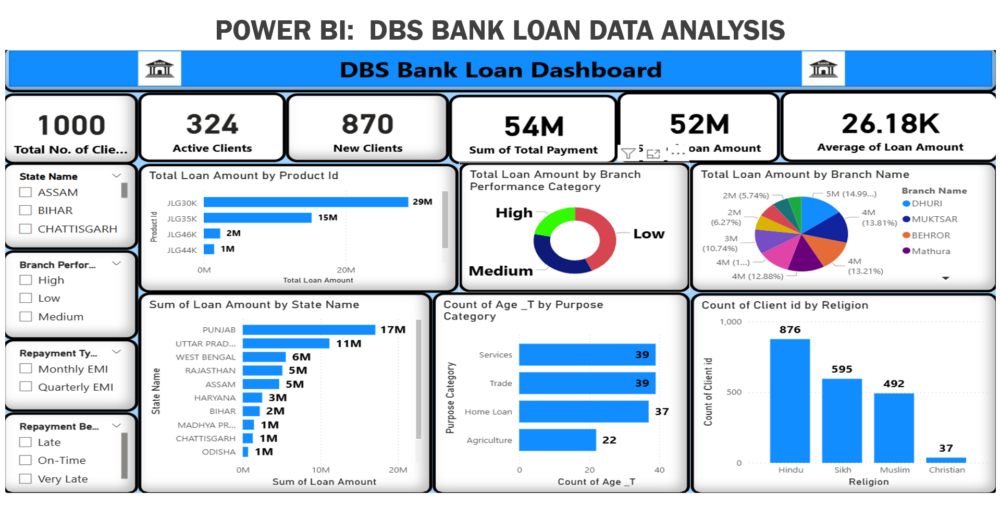
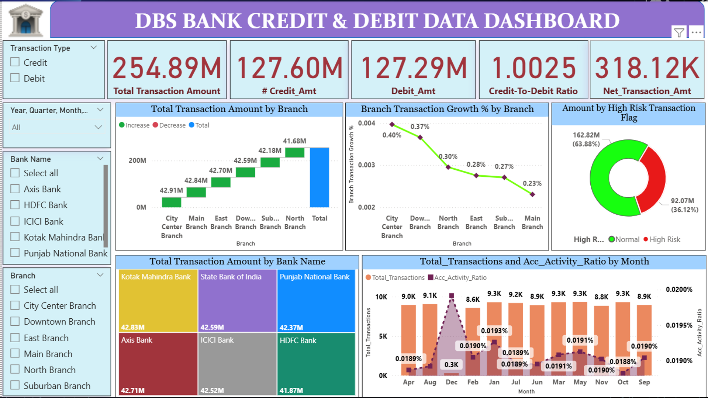

# 🏦 DBS Bank Data Analysis

This project presents a data-driven analysis of **DBS Bank’s customer and transaction data** using **SQL, Excel, Tableau, and Power BI** to identify key business insights and financial trends.

---

## 📊 Project Overview
The aim of this analysis is to:
- Examine customer spending and transaction behavior  
- Identify top-performing regions and products  
- Track account growth and customer engagement metrics  
- Visualize key banking KPIs through dashboards

---

## 🧠 Tools & Technologies
- **SQL** – Data extraction, joins, and aggregations  
- **Excel** – Data cleaning and preprocessing  
- **Tableau** – Interactive dashboards  
- **Power BI** – KPI visualization and trend tracking  

---

## 📂 Project Structure
dbs-bank-analysis/
│
├── data/ - Contains raw and processed data files
├── sql_queries/ - SQL scripts used for data insights
├── dashboards/ - Tableau & Power BI dashboards + screenshots
└── README.md - Project documentation

---

## 📈 Key Insights
- Monthly and yearly transaction volume trends  
- High-value customer segments and regional distribution  
- Revenue growth comparison across quarters  
- Key performance indicators visualized using Tableau & Power BI  

---

## 🖥️ Visualizations
| Tool | File | Description |
|------|------|--------------|
| Tableau | `Tableau Dashboard on Debit & Credit Dataset.twbx`,`Tableau Dashboard On Loan Dataset.twbx`| Interactive customer and transaction insights |
| Power BI | `Power BI Dashboard on Loan Dataset.pbix`, `Power BI Dashboard on Debit & Credit Dataset.pbix` | KPI and financial performance dashboards |
| Excel | `Excel Dashboard on Loan Dataset.xlsx`,`Excel Dashboard on Debit & Credit Dataset.xlsx` | Cleaned dataset and pivot analyses |
| SQL | `SQL Queries on Loan Dataset.sql`, `SQL Query on Credit & Debit Dataset.sql`| Queries for transaction insights |

---

## 📸 Sample Dashboard

---

## 📬 Author
Shravani Sachin Dhuri  
Data Analyst | Tableau | Power BI | SQL | Excel_
